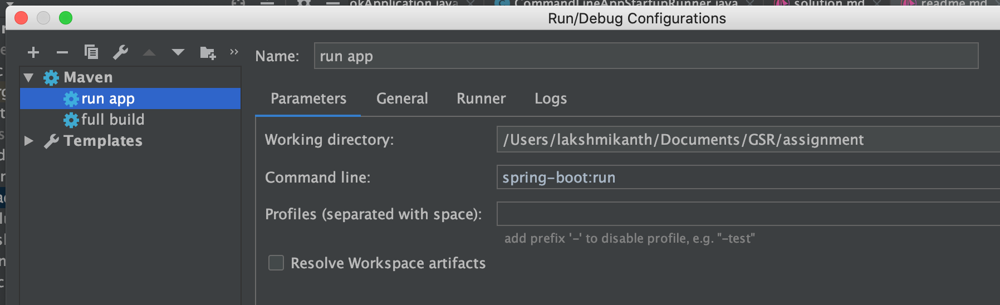

# OrderBook Builder and Report-Generator


## Tech-Stack:
1. Algorithm is implemented in jdk-8 and runs on jre-8
3. Maven project
4. Spring-Boot for Dependency Injection and Application Run


## Pre-Requisites to build and run the application:

### Maven based package and start:

1.  Essentials:  maven 3.3.9 + and jdk-8, jre-8


## How to Run application from command-line:

- Accept ticker from the commandLine Argument

 ```shell
  ./orderbook_manager_console.sh

 ``` 


## How to Run application from IntelliJ:




## get Order Data from L2 Data of Coinbase:

 
### OrderBook Command execution Flow: 
 
- If you have issues to run command on console, make sure you have set
  Maven and Java Home in your environment variables
  
- As a workaround, you can run the mvn clean install & mvn
  spring-boot:run from your intelliJ Run configurations

- Connect to Coinbase-pro websocket feed 

- Generate Subscription Message for L2 Data of Coinbase

  ```json
   {
     "type": "subscribe",
     "channels": [
         "level2",
         {
             "name": "ticker",
             "product_ids": [
                 "BTC-USD"
               ]
           }
       ]
   }
   ```

- Subscribe to the L2 data

```java
    public void startOrderBook(String ticker) throws Exception {
        LOG.info("starting Building Order-Book for Ticker: "+ticker);
        COINBASE_SUBSCRIBE_MESSAGE = COINBASE_SUBSCRIBE_MESSAGE.replace("tickerReplaceableByCommandLineArgument",ticker);
        LOG.info("COINBASE_SUBSCRIBE_MESSAGE after commandline: "+COINBASE_SUBSCRIBE_MESSAGE);
        initWebSocketCommunication();
    }

    private  void initWebSocketCommunication()  throws Exception{

        System.setProperty("https.protocols", "TLSv1.2,TLSv1.1,SSLv3");

        String destUri = "wss://ws-feed.pro.coinbase.com";

        WebSocketClient client = new WebSocketClient(new SslContextFactory());
        try {
            LOG.info("connecting to coinbase-feed");
            client.start();
            URI echoUri = new URI(destUri);
            ClientUpgradeRequest request = new ClientUpgradeRequest();
            client.setMaxBinaryMessageBufferSize(169406);
            client.setMaxTextMessageBufferSize(169406);
            client.connect(this, echoUri, request);
            LOG.info("done connecting");
        } catch (Throwable t) {
            t.printStackTrace();
        }
    }
```

## Command Line Arguments:

-  Once the Application is started, Application prompts for the
   ticker/pair for which order book has to be updated
   
- the console log looks like:

```shell
2020-11-09 16:26:51.861  INFO 59451 --- [  restartedMain] orderbook.CommandLineAppStartupRunner    : 

 Please enter the ticker and press ENTER to start building OrderBook. 

 To kill this application, press Ctrl + C. 

  ticker:  BTC-USD
```

- The Order Book start getting built immediately after you enter the
  ticker.
  
```shell
2020-11-09 16:27:00.289  INFO 59451 --- [  restartedMain] o.w.CoinbaseWebSocketServiceImpl         : starting Building Order-Book for Ticker: BTC-USD
2020-11-09 16:27:00.289  INFO 59451 --- [  restartedMain] o.w.CoinbaseWebSocketServiceImpl         : COINBASE_SUBSCRIBE_MESSAGE after commandline:  {
     "type": "subscribe",
     "channels": [
         "level2",
         {
             "name": "ticker",
             "product_ids": [
                 "BTC-USD"
               ]
           }
       ]
 }
2020-11-09 16:27:00.381  INFO 59451 --- [  restartedMain] o.w.CoinbaseWebSocketServiceImpl         : connecting to coinbase-feed
2020-11-09 16:27:00.811  INFO 59451 --- [  restartedMain] o.w.CoinbaseWebSocketServiceImpl         : done connecting
2020-11-09 16:27:02.033  INFO 59451 --- [t@1225541703-43] o.w.CoinbaseWebSocketServiceImpl         : Got connect: %s%n
2020-11-09 16:27:02.313 ERROR 59451 --- [t@1225541703-41] o.w.CoinbaseWebSocketServiceImpl         : Failed to receive a valid Order message from Coinbase: 
2020-11-09 16:27:02.313 ERROR 59451 --- [t@1225541703-41] o.w.CoinbaseWebSocketServiceImpl         : Failed to receive a valid Order message from Coinbase: 
2020-11-09 16:27:02.334  INFO 59451 --- [t@1225541703-41] orderbook.service.OrderBookImpl          : Offering best Bid-Order: 
| Order	time= 1604910420	tradeId = 108425477	ticker = BTC-USD	side = buy	price = 15238.81	quantity = 0.00157017
2020-11-09 16:27:02.335  INFO 59451 --- [t@1225541703-41] o.w.CoinbaseWebSocketServiceImpl         : 
 -------------------------------------------------------

2020-11-09 16:27:02.335  INFO 59451 --- [t@1225541703-41] o.w.CoinbaseWebSocketServiceImpl         : 

 OrderBookReport: 


 -------------------------------------------------------
			Bid-Orders:			

 -------------------------------------------------------

| Order	time= 1604910420	tradeId = 108425477	ticker = BTC-USD	side = buy	price = 15238.81	quantity = 0.00157017

 -------------------------------------------------------

 -------------------------------------------------------
			Ask-Orders:		
			
-------------------------------------------------------


 -------------------------------------------------------
			Bid-Orders:			

 -------------------------------------------------------

| Order	time= 1604910420	tradeId = 108425477	ticker = BTC-USD	side = buy	price = 15238.81	quantity = 0.00157017

| Order	time= 1604910424	tradeId = 108425479	ticker = BTC-USD	side = buy	price = 15238.81	quantity = 0.0128553

| Order	time= 1604910432	tradeId = 108425484	ticker = BTC-USD	side = buy	price = 15233.18	quantity = 0.23262896

| Order	time= 1604910432	tradeId = 108425483	ticker = BTC-USD	side = buy	price = 15233.17	quantity = 0.10798604

 -------------------------------------------------------

 -------------------------------------------------------
			Ask-Orders:			

 -------------------------------------------------------

| Order	time= 1604910431	tradeId = 108425482	ticker = BTC-USD	side = sell	price = 15233.81	quantity = 0.46943409

| Order	time= 1604910424	tradeId = 108425478	ticker = BTC-USD	side = sell	price = 15238.8	quantity = 0.00201795

| Order	time= 1604910431	tradeId = 108425480	ticker = BTC-USD	side = sell	price = 15238.8	quantity = 0.07755589

| Order	time= 1604910431	tradeId = 108425481	ticker = BTC-USD	side = sell	price = 15238.8	quantity = 0.00794267

 -------------------------------------------------------
			
				
```


## OrderBook Builder:

- Order Book is updated for every new tickerEvent
- OrderBook contains orders segregated by Bid And Ask
  - A Bid Order is the one with side: Buy
  - An Ask Order is the one with side: Sell
- Best bid Order is the one which has highest Price (Bid Price)
- Best Ask Order is the one which has lowest Price (Ask Price)

- Order Book is of L10, i.e at any time order book contains 10 Bids and 10 Asks
- For each new OrderEvent, lookup in Orderbook if it can replace the existing orders based on sorting by orderPrice
- Sort the Orders in the OrderBook once it is appended.

## Add Order to OrderBook:

 - As OrderBook has 2 groups Bid and Ask
 - An incoming Buy-order will be added to Bid
 
   ```java
   
    public void addOrderToBids(Order order){

        if(bids.size() > 0){

            if(bids.peekFirst().getPrice() < order.getPrice()){

                if(bids.size() == 10) {
                    Order order_Polled = bids.pollLast();
                    LOG.info("KnockingOut Bid-Order: " + order_Polled);
                }

                LOG.info("Offering best Bid-Order: "+order);
                bids.offerFirst(order);
            } else {
                if (bids.size() < 10) {
                    LOG.info("filling Bid-Order: "+order);
                    bids.offerLast(order);
                }
            }

            Collections.sort(bids, OrderComparator.DescBidComparer());

        }else{
            LOG.info("Offering best Bid-Order: "+order);
            bids.offerLast(order);
        }

    }

   ```
   
 - An incoming Sell-order will be added to Ask
 
   ```java
    public void addOrderToAsks(Order order){

        if(asks.size() > 0){

            if(asks.peekFirst().getPrice() > order.getPrice()){

                if(asks.size() == 10) {
                    Order order_Polled = asks.pollLast();
                    LOG.info("KnockingOut Ask-Order: " + order_Polled);
                }

                LOG.info("Offering best Ask-Order: "+order);
                asks.offerFirst(order);
            } else {
                if (asks.size() < 10) {
                    LOG.info("filling Ask-Order: "+order);
                    asks.offerLast(order);
                }
            }

            Collections.sort(asks, OrderComparator.DescAskComparer());

        }else{
            LOG.info("Offering best Ask-Order: "+order);
            asks.offerLast(order);
        }
    }
   ```  


## Core sorting logic for OrderBook:

 - Orders in Bid/Ask are sorted based on OrderPrice.
 
 - I have implemented a Comparator which sorts the Orders in OrderBook based on the direction of the OrderSide: Bid/Ask or Buy/Sell
 
 ```java
 public class OrderComparator implements Comparator<Order> {

    //-1 for Bid comparer
    //1 for Ask comparer
    private int _priceComparisonCoeff;

    OrderComparator(int priceComparisonCoeff)
    {
        _priceComparisonCoeff = priceComparisonCoeff;
    }

    @Override
    public int compare(Order x, Order y) {

        //two limit orders
        if (x.getPrice()!= y.getPrice())
        {
            return _priceComparisonCoeff * x.getPrice().compareTo(y.getPrice());
        }

        if (x.getTime() != y.getTime())
        {
            return x.getTime().compareTo(y.getTime());
        }


        //they have the same characteristics. not necessary same ID
        //not good because we are not supposed to have two equivalent orders in the orderbook
        return 0;
    }


    public static OrderComparator DescBidComparer()
    {
        return new OrderComparator(-1);
    }

    public static OrderComparator DescAskComparer()
    {
        return new OrderComparator(1);
    }
}
 
 ```